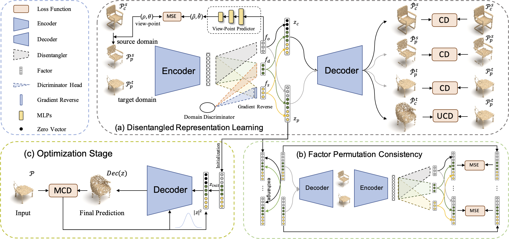

# Optimization over Disentangled Encoding: Unsupervised Cross-Domain Point Cloud Completion via Occlusion Factor Manipulation
by Jingyu Gong*, Fengqi Liu*, Jiachen Xu, Min Wang, Xin Tan, Zhizhong Zhang, Ran Yi, Haichuan Song, Yuan Xie, Lizhuang Ma. (*=equal contribution) 

<p align="center">  </p>
## Introduction
This project is based on our ECCV2022 paper.
```
@inproceedings{gong2022optde,
    title={Optimization over Disentangled Encoding: Unsupervised Cross-Domain Point Cloud Completion via Occlusion Factor Manipulation},
    author={Gong, Jingyu and Liu, Fengqi and Xu, Jiachen and Wang, Min and Tan, Xin and Zhang, Zhizhong and Yi, Ran and Song, Haichuan and Xie, Yuan and Ma, Lizhuang},
    booktitle={European Conference on Computer Vision (ECCV)},
    year={2022}
}
```
## Installation
Please follow the instruction to set up your own environment.
```
git clone git@github.com:azuki-miho/OptDE.git
cd OptDE
mkvirtualenv optde
workon optde
pip install -r requirements.txt
```
## Dataset
We conduct our experiments on [3D-FUTURE](https://tianchi.aliyun.com/specials/promotion/alibaba-3d-future), [ModelNet](modelnet.cs.princeton.edu), [ScanNet](www.scan-net.org), [MatterPort3D](https://niessner.github.io/Matterport/) and [KITTI](www.cvlibs.net/datasets/kitti/). We obtain the models from [3D-FUTURE](https://tianchi.aliyun.com/specials/promotion/alibaba-3d-future), [ModelNet40](modelnet.cs.princeton.edu) and modify the virtual rendering code in [PCN](https://github.com/wentaoyuan/pcn) to generate the partial and complete point clouds which is available [here](https://pan.baidu.com/s/1hg1362wqahacsONU-05GEg) with password: 542h. We obtain the partial scans of [ScanNet](www.scan-net.org), [MatterPort3D](https://niessner.github.io/Matterport/) and [KITTI](www.cvlibs.net/datasets/kitti/) from [pcl2pcl](https://github.com/xuelin-chen/pcl2pcl-gan-pub), please download them and put them in ./datasets/data. We take [CRN](https://github.com/xiaogangw/cascaded-point-completion) as our source domain and obtain the partial and completes shapes from [CRN dataset](https://drive.google.com/file/d/1MzVZLhXOgfaLZjn1jDrwuiCB-XCfaB-w/view?usp=sharing).
## Usage
### Preparation
We also utilize the discrimination loss like ShapeInversion in our baseline, so please download the pretrained discriminator models from [ShapeInversion](https://github.com/junzhezhang/shape-inversion) and save them to `./pretrained_models/'. If you want to take other source domain data, you can use the code in [ShapeInversion](https://github.com/junzhezhang/shape-inversion) for discriminator pretraining.
### Desentangled Encoding Training
For desentangled encoding training with CRN chair as source domain and 3D-FUTURE chair as target domain, run the following script:
```
sh run.sh 0
```
For other experiment setting, you can change the `REALDATA`, `VCLASS` and `RCLASS` variables in `run.sh`. If you want to change the log directory, please modify the `LOGDIR` in `run.sh`.
### Optimization over Disentangled Encoding
For optimization over disentangled encoding with CRN chair as source domain and 3D-FUTURE chair as target domain, please first change the `LOGDATE` in `run_optimizer.sh` to your log file name and run the following script:
```
sh run_optimizer.sh 0
```
For other experiment setting, you can change the `REALDATA`, `VCLASS` and `RCLASS` variables in `run_optimizer.sh`. If you want to change the log directory, please modify the `LOGDIR` in `run_optimizer.sh`.
## Acknowledgement
This code is based on [ShapeInversion](https://github.com/junzhezhang/shape-inversion), [ChamferDistancePytorch](https://github.com/ThibaultGROUEIX/ChamferDistancePytorch), [PCN](https://github.com/wentaoyuan/pcn) and [pcl2pcl](https://github.com/xuelin-chen/pcl2pcl-gan-pub). The models used for partial and complete shape generation are from [3D-FUTURE](https://tianchi.aliyun.com/specials/promotion/alibaba-3d-future), [ModelNet](modelnet.cs.princeton.edu). CRN and real-world point clouds are provided by [CRN](https://github.com/xiaogangw/cascaded-point-completion) and [pcl2pcl](https://github.com/xuelin-chen/pcl2pcl-gan-pub). If you find they are useful, please also cite them in your work. 
